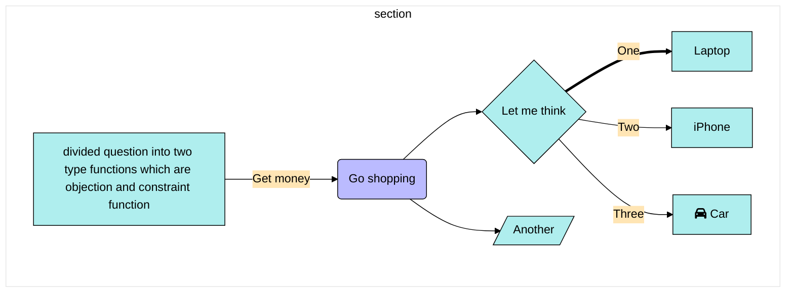

# question divided into two function

objection and constraints.

this classficition can easy find solution?

this arrangement can easy find solution? or just systemlze?

```mermaid
%%{
  init: {
    'theme': 'base',
    'themeVariables': {
      'primaryColor': '#AFEEEE',
      'primaryTextColor': '#000000',
      'primaryBorderColor': '#000000',
      'lineColor': '#000000',
      'secondaryColor': '#FFE5B4',
      'tertiaryColor': '#fff'
    }
  }
}%%
        graph TD
          subgraph section
          A[divided question into two type functions which are objection and constraint function] -->|Get money| B(Go shopping)
          B --> C{Let me think}
          B --> G[/Another/]
          C ==>|One| D[Laptop]
          C -->|Two| E[iPhone]
          C -->|Three| F[fa:fa-car Car]
          style B fill:#bbf
          end
```
