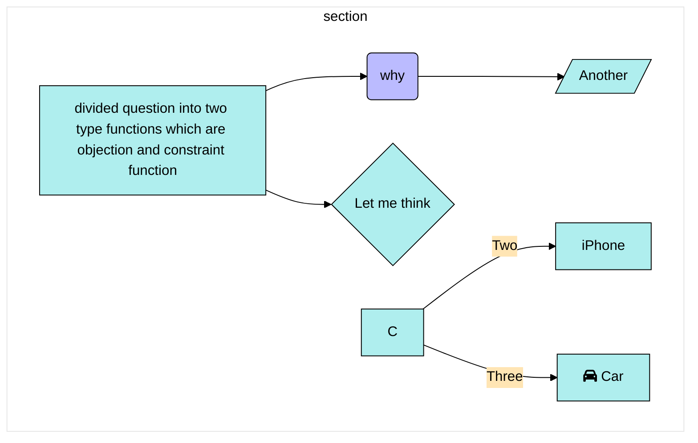

# question divided into two function

objection and constraints.

this classification can easy find a solution?

this arrangement can easy find solution? or just systemlze?

[]is an answer () is a question.

