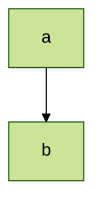
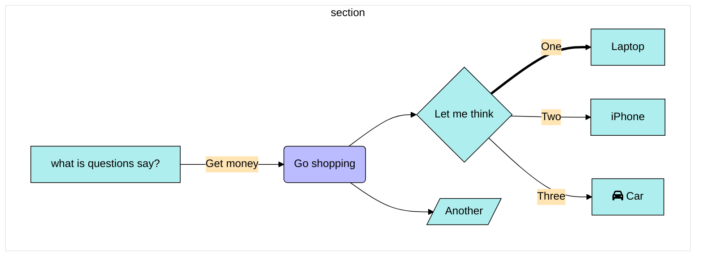

@ -> i observe, & -> my question, % -> copy

@ how to get desire numbers?

- @ find a minimize or maxmize solution.
  - & Is desired numbers a minimize or maxmize solution? maybe not, but a minimize or maxmize solution can be a minimizing or maxmizing function which is desired numbers combination
  - & why and how we let desired numbers be a minimize or maxmize solution? 
  - & what is desire numbers and a minimize or maxmize solution relation? 
  - & how to get a minimize or maxmize solution? 
  - & what kinds of Mathematical object is relationship with minimize or maxmize value?
- & have any other method to get desire numbers?

% [minimizing a convex differentiable function](https://scholar.google.com/citations?view_op=view_citation&hl=zh-TW&user=Mqz_yhAAAAAJ&citation_for_view=Mqz_yhAAAAAJ:Z5m8FVwuT1cC)



```mermaid
%%{init: {'theme': 'base','themeVariables': {'darkMode': 'false', 'primaryColor': 'default','primaryTextColor': '#7C0000','primaryBorderColor': '#F8B229','lineColor': '#006100','secondaryColor': '#fff','tertiaryColor': '#7C0000', 'background' : '#f4f4f4'} }}%%
graph TD
    A[afff]-->B
    A[afff]-->C
    B-->D
    C-->D
```



