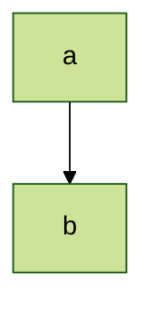
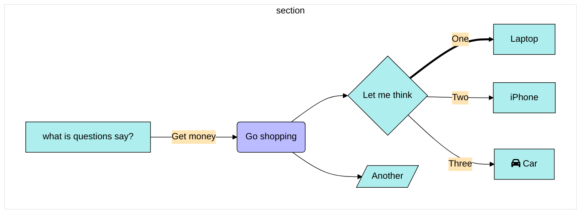

# test graph




```mermaid
%%{init: {'theme': 'base','themeVariables': {'darkMode': 'false', 'primaryColor': 'default','primaryTextColor': '#7C0000','primaryBorderColor': '#F8B229','lineColor': '#006100','secondaryColor': '#fff','tertiaryColor': '#7C0000', 'background' : '#f4f4f4'} }}%%
graph TD
    A[afff]-->B
    A[afff]-->C
    B-->D
    C-->D
```



